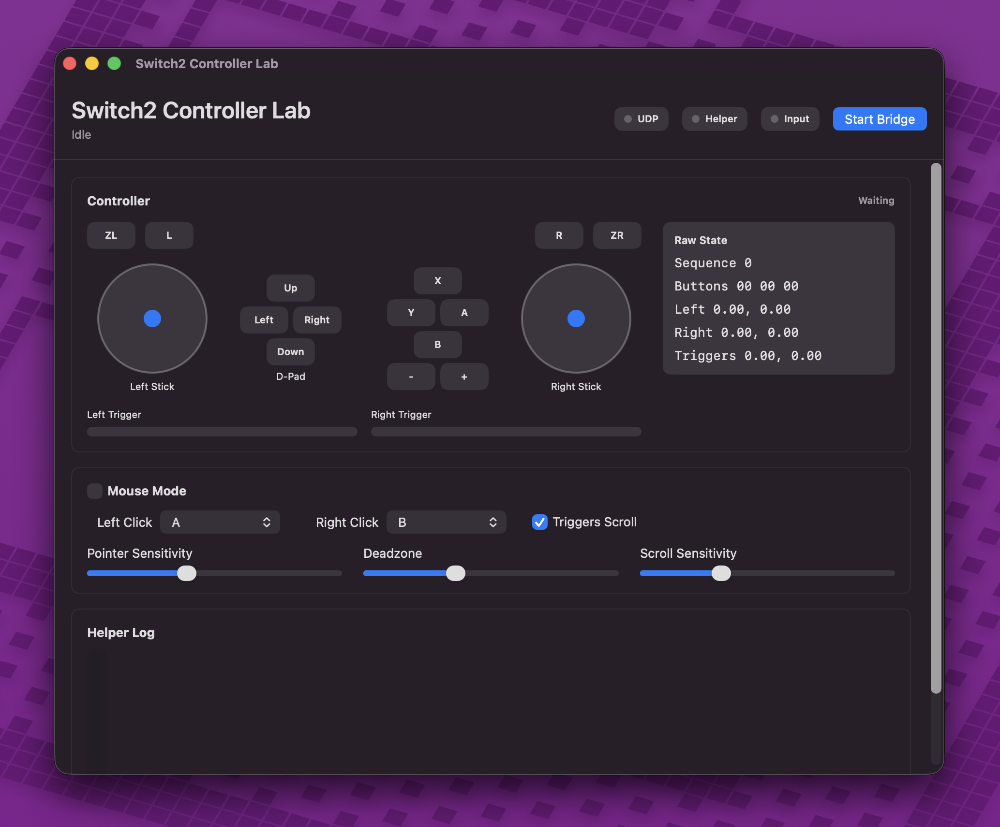

# Switch2 Controller Lab macOS App

This folder contains the SwiftUI macOS app for Switch2 Controller Lab.

The app bundles the native `switch2_mac_bridge` helper, starts and stops it
from the UI, receives the helper's localhost UDP stream, displays live
controller state, and includes an experimental mouse mode.



## Current Features

- Builds a local `.app` bundle.
- Bundles the native USB/HID helper.
- Bundles `libusb-1.0.0.dylib` and rewrites the helper install name.
- Ad-hoc signs the app for local testing.
- Starts and stops bridge streaming from the UI.
- Listens on UDP port `28782`.
- Displays a live controller diagram.
- Highlights pressed buttons.
- Shows stick and trigger meters.
- Shows helper logs.
- Uses the left stick as a mouse pointer in mouse mode.
- Allows configurable left-click and right-click buttons.
- Supports trigger-based scrolling.
- Provides sensitivity, deadzone, and scroll sensitivity controls.

Planned:

- User-editable UDP port in the app UI.
- Saved mapping profiles.
- App icon.
- Signed and notarized distribution build.
- Signed `.pkg` installer.

## Requirements

- macOS 13 or newer
- Xcode Command Line Tools
- Homebrew
- `libusb`

Install dependencies:

```sh
brew install libusb pkg-config
```

## Build

From the repository root:

```sh
Switch2ControllerLabApp/build_app.sh
```

The app bundle is written to:

```text
Switch2ControllerLabApp/dist/Switch2 Controller Lab.app
```

The build script detects the architecture of the installed `libusb` library and
builds the bundled helper to match it. On Apple Silicon Macs with Intel
Homebrew under `/usr/local`, the helper is built as `x86_64` and runs through
Rosetta while the SwiftUI app remains native arm64.

## Build A Local Installer

After building the app, create an unsigned local installer package:

```sh
Switch2ControllerLabApp/package_app.sh
```

The package is written to:

```text
Switch2ControllerLabApp/dist/Switch2ControllerLab-0.1.0.pkg
```

The package installs `Switch2 Controller Lab.app` into `/Applications`.

## Run

Open the built app:

```sh
open "Switch2ControllerLabApp/dist/Switch2 Controller Lab.app"
```

Connect a Switch 2 Pro Controller over USB and click `Start Bridge`.

The app starts the bundled helper with:

```sh
switch2_mac_bridge --udp 127.0.0.1:28782
```

The Unity package listens on the same port by default.

## Mouse Mode

Mouse mode is experimental. It uses CoreGraphics events from the app process:

- Left stick moves the pointer.
- Configured button sends left mouse down/up.
- Configured button sends right mouse down/up.
- Triggers can scroll.

macOS Accessibility permission is required for pointer, click, and scroll event
posting. The app prompts for that permission when mouse mode is enabled.

## Architecture Notes

The app currently launches the bundled helper process. A production version
should share the native USB/HID code through a small C module or library that
Swift can call directly.

Current helper responsibilities:

- USB enumeration and initialization through `libusb`.
- HID report handling through IOKit.
- Controller report decoding.
- UDP bridge output.

App responsibilities:

- Helper lifecycle.
- UDP packet reception.
- SwiftUI visualization.
- Mouse mode input synthesis.

## Packaging Plan

Development milestones:

1. Build a local `.app`.
2. Add app-side settings storage.
3. Package as a local `.pkg` with `pkgbuild`.
4. Add Developer ID code signing and notarization for distribution beyond local
   testing.

System-wide virtual gamepad support is intentionally separate from the Unity
bridge. A virtual gamepad driver would require DriverKit or system-extension
work, signing, entitlements, and a heavier install path.
